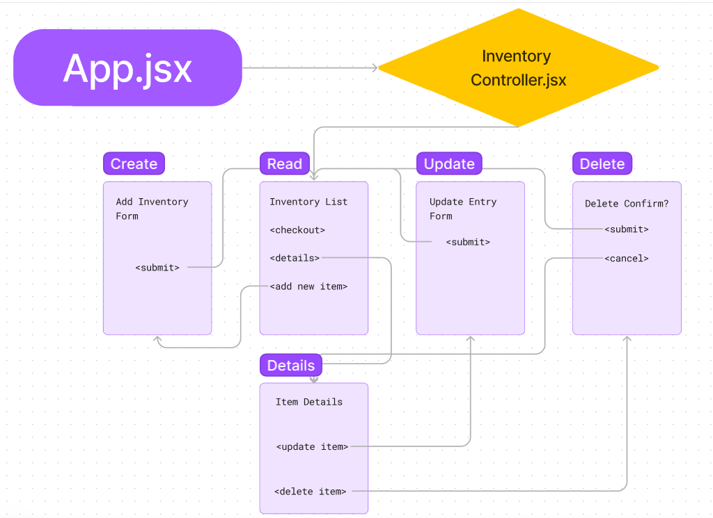

# _Kai's Inventory Management_

#### By _**Kai Clausen**_

#### _{Brief description of application}_

## Technologies Used

* _HTML_
* _REACT_
* _create-react-app_
* _JavaScript_
* _CSS_

## Description

_This Application is an Inventory Tracker For Kai's Coffee Shoppe. It was created for an Independent Code Review. Styling was not imperative. The application has Create, Read, Update. Stretch goal was Delete functionality._

## Component Diagram



## Setup/Installation Requirements

* _Clone this Repository_
* _Navigate to the top directory in you command line_
* _Enter the command ```npm i```_
* _When that is finished enter the command ```npm start```_


## Known Bugs

* _The application throws a warning for unused variables. They are used implicitly._
* _The Component Diagram illustrates a Delete page. This has not been implemented yet._
* _The Create functionality allows for negative numbers to be input._

## License

MIT - If you find any bugs, feel free to fix them yourself, or contact Kai at kaiclausen123@gmail.com. Feedback is welcome and appreciated!

Copyright (c) _2023_ _Kai Clausen_